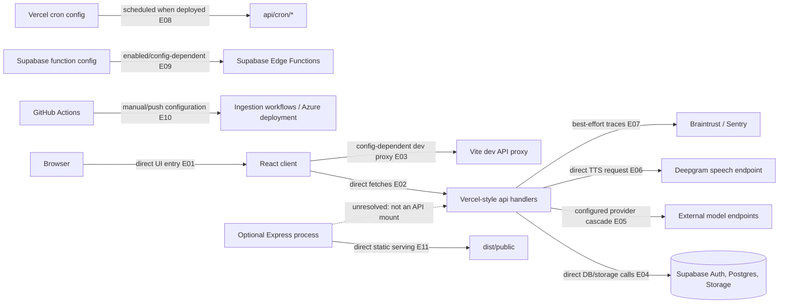

# 01 — System context and deployed boundaries

## Plain-language

The browser is the front door; the repository routes its requests into several distinct back rooms: file-based API handlers, Supabase-backed data, model providers, and scheduled or manually invoked jobs. A second static-server path and a separate Azure workflow also exist in the tree, so the configuration does not identify one indisputable production topology by itself.

## Product/system

The primary application shape in source is a Vite-built client plus Vercel-style `api/` handlers. The client uses those handlers for Billy, DI, auth, actions, exports, and other route families. Server code independently calls Supabase, selected model providers, and Deepgram. Vercel cron declarations schedule four handler paths; five Supabase Edge Functions are enabled in local configuration. A standalone Express process serves the client build and a Sentry test endpoint; it does not mount the `api/` handlers.

## Engineering

### Evidence keys

- **E01–E02 — Direct code path, high:** browser bootstrap and route tree in [`client/src/main.tsx`](../../client/src/main.tsx) and [`client/src/App.tsx`](../../client/src/App.tsx); client helpers include [`client/src/lib/billyApi.ts`](../../client/src/lib/billyApi.ts) and [`client/src/lib/diApi.ts`](../../client/src/lib/diApi.ts).
- **E03 — Configuration-dependent, medium:** Vite dev proxy in [`vite.config.ts`](../../vite.config.ts). The target is configurable; a local browser run is not evidence that it reaches the v3 handlers.
- **E04 — Direct code path, high:** shared Supabase access in [`api/_lib/supabase.ts`](../../api/_lib/supabase.ts), plus `api/di.ts` and Codex persistence.
- **E05 — Configuration-dependent, high for code, unresolved for availability:** provider registry/cascade in [`api/_lib/llmRouter.ts`](../../api/_lib/llmRouter.ts).
- **E06 — Direct code path, high:** [`api/voice/billy.ts`](../../api/voice/billy.ts) calls Deepgram and returns WAV.
- **E07 — Optional/configuration-dependent, medium:** [`instrument.js`](../../instrument.js), [`api/_lib/sentry.ts`](../../api/_lib/sentry.ts), and `traceBraintrust` use in the model/voice paths.
- **E08 — Configuration-dependent, high for declaration:** [`vercel.json`](../../vercel.json) names four cron routes; deployment is not verified.
- **E09 — Configuration-dependent, high for local config:** [`supabase/config.toml`](../../supabase/config.toml) enables five Edge Functions; several have JWT verification disabled and implement a separate shared-secret boundary.
- **E10 — Configuration-dependent, high for workflow declaration:** [`.github/workflows/main_gestaltview.yml`](../../.github/workflows/main_gestaltview.yml) and the manual ingestion workflows declare CI/deployment paths. The Azure target and Vercel config coexist; active production ownership is unresolved.
- **E11 — Direct code path, high:** [`server/index.ts`](../../server/index.ts) serves static files and a guarded Sentry debug route. It does not mount API handlers.

## Boundaries and confidence

The diagram describes source and checked-in configuration, not a live environment. The `api/` shape is the Vercel-style primary server surface inferred from repository layout; actual endpoint reachability depends on deployment. Supabase, model services, Deepgram, Sentry, and Braintrust are external boundaries; their internals and current availability are outside this repository inspection. Vite proxy defaults, the Azure workflow, and Vercel configuration are separate declarations, not proof of a single current deployment.
