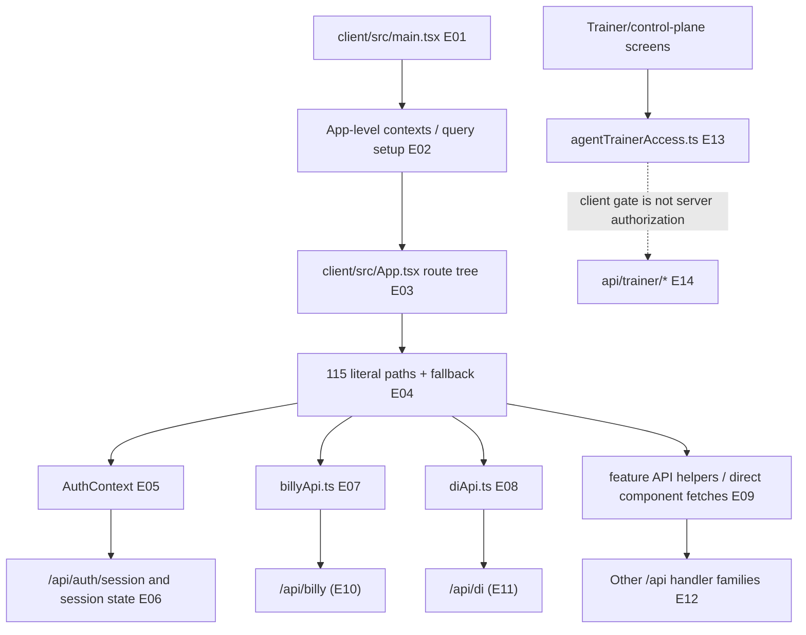

# 02 — Client surfaces and navigation

## Plain-language

The client is a large route catalogue wrapped around shared auth and Billy context. A screen can initiate a request, but meaningful authorization still has to be enforced by the API; a hidden or guarded button is not the trust boundary.

## Product/system

The browser starts at `client/src/main.tsx`, mounts the React application, and enters the route tree in `client/src/App.tsx`. The checked source contains **115 distinct literal route paths**, plus client-side fallback routing. From those routes, feature pages call purpose-specific helpers—such as Billy and DI—while some components call their endpoint directly. Shared contexts coordinate session status and Billy state; feature-level pages own the concrete screen behavior.

## Engineering

### Evidence keys

- **E01–E03 — Direct code path, high:** bootstrap/provider and route composition in [`client/src/main.tsx`](../../client/src/main.tsx) and [`client/src/App.tsx`](../../client/src/App.tsx).
- **E04 — Direct code path, high:** 115 unique literal route values extracted from [`client/src/App.tsx`](../../client/src/App.tsx); [`inventory.json`](inventory.json) records each path and source line. The catch-all is separate.
- **E05–E06 — Direct code path, high:** [`client/src/contexts/AuthContext.tsx`](../../client/src/contexts/AuthContext.tsx) reads session state and `/api/auth/session`; session endpoints are under [`api/auth/`](../../api/auth/).
- **E07/E10 — Direct code path, high:** [`client/src/lib/billyApi.ts`](../../client/src/lib/billyApi.ts) posts to `/api/billy`.
- **E08/E11 — Direct code path, high:** [`client/src/lib/diApi.ts`](../../client/src/lib/diApi.ts) posts to `/api/di`.
- **E09/E12 — Direct code path, medium:** feature-specific client helpers and direct fetches map to the route inventory; complete runtime reachability is configuration-dependent.
- **E13 — Direct client gate, high:** [`client/src/lib/agentTrainerAccess.ts`](../../client/src/lib/agentTrainerAccess.ts) contains the founder/admin access decision used by trainer UI.
- **E14 — Direct server-side gate, high for trainer helper:** [`api/trainer/_helpers.ts`](../../api/trainer/_helpers.ts) separately enforces founder/admin access for protected trainer handlers.

## Boundaries and caveats

The route count is a reproducible source count, not an assertion that every path is navigable in the deployed site. A client-side gate improves navigation but is not a substitute for server-side authorization. The atlas records route and provider structure without summarizing all 115 screens individually; the complete literal route list is in `inventory.json`.
