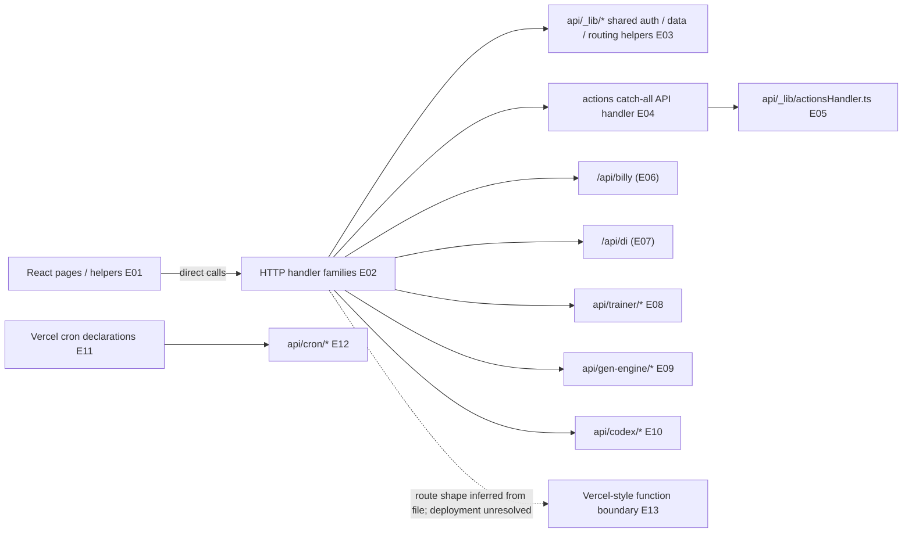

# 03 — HTTP/API surface and handler ownership

## Plain-language

The API is not one monolithic server module. It is a collection of handler files grouped by product area, with a shared helper layer underneath. The map counts what is implemented in the tree; it does not pretend that every file has been deployed or called by a screen.

## Product/system

The client-facing handler surface is grouped around auth/session, Billy and DI, actions, trainer, Gen Engine, Codex, profile, transcriptory, gates, and scheduled work. The route family `api/actions/[...path].ts` delegates to a shared action dispatcher, while some feature endpoints have dedicated handlers. The checked tree has **169 default-export handler candidates** after excluding helper/test files. The inventory preserves each file path and a filesystem-derived route stub so an engineer can review it without accepting the stub as a deployment fact.

## Engineering

### Evidence keys

- **E01 — Direct code path, high:** client API helpers including [`client/src/lib/billyApi.ts`](../../client/src/lib/billyApi.ts), [`client/src/lib/diApi.ts`](../../client/src/lib/diApi.ts), and feature-specific components.
- **E02 — Direct code path, high for source inventory:** [`inventory.json`](inventory.json) enumerates the 169 default-export handler candidates from `api/` and groups them by file path. The large families include trainer (29), actions (16), Gen Engine (12), gate (11), modules (10), and Codex (8); remaining families are also retained.
- **E03 — Direct code path, high:** [`api/_lib/auth.ts`](../../api/_lib/auth.ts), [`api/_lib/supabase.ts`](../../api/_lib/supabase.ts), and [`api/_lib/llmRouter.ts`](../../api/_lib/llmRouter.ts) centralize auth, data, and provider behavior.
- **E04–E05 — Direct code path, high:** [actions catch-all handler](../../api/actions/%5B...path%5D.ts) and [`api/_lib/actionsHandler.ts`](../../api/_lib/actionsHandler.ts).
- **E06 — Direct code path, high:** [`api/billy.ts`](../../api/billy.ts).
- **E07 — Direct code path, high:** [`api/di.ts`](../../api/di.ts).
- **E08 — Direct code path, high:** trainer handlers include [`api/trainer/agents.ts`](../../api/trainer/agents.ts) and the shared checks in [`api/trainer/_helpers.ts`](../../api/trainer/_helpers.ts).
- **E09 — Direct code path, high:** the artifact handler is [`api/gen-engine/artifacts.ts`](../../api/gen-engine/artifacts.ts).
- **E10 — Direct code path, high:** the Codex forge handler is [`api/codex/forge.ts`](../../api/codex/forge.ts).
- **E11–E12 — Configuration-dependent, high for declaration:** [`vercel.json`](../../vercel.json) lists cron paths; [`api/cron/codex-drain.ts`](../../api/cron/codex-drain.ts) is one matched handler.
- **E13 — Unresolved, medium:** [`vercel.json`](../../vercel.json) and [`package.json`](../../package.json) establish build/deployment configuration, but no production endpoint probe was performed.

## Boundaries and caveats

“169 handlers” is deliberately called a candidate count: it is based on source-file shape, not a live Vercel function inventory. Filesystem route stubs in `inventory.json` do not account for every rewrite, alias, external gateway, or deployment override. The maps focus on connected paths and representative families; the machine inventory retains the full handler list.
