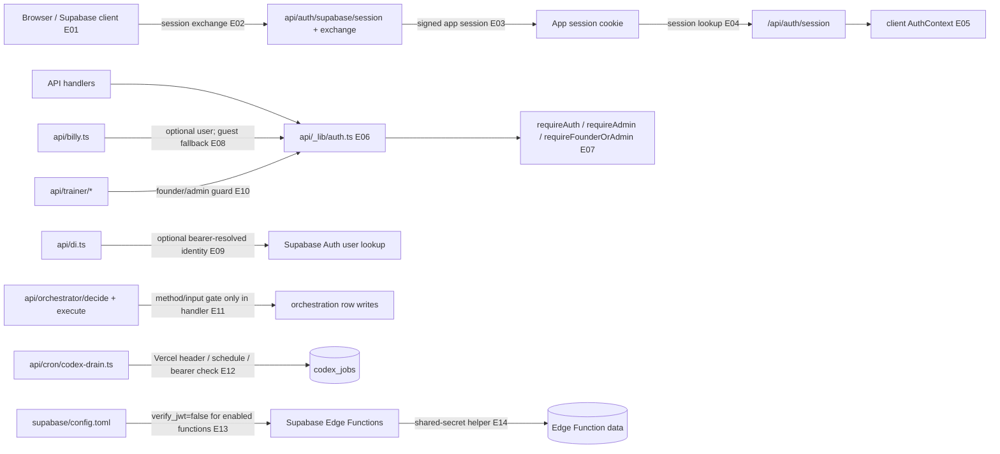

# 04 — Authentication and trust boundaries

## Plain-language

The browser's identity begins with Supabase Auth, but the app also establishes its own server-validated session path. Some routes require a signed-in user or founder/admin status; other routes accept anonymous use. The protection is not uniform, so each API path must be read on its own terms.

## Product/system

The browser exchanges or synchronizes a Supabase session with app endpoints, then asks the API for current session state. Server helpers parse the app cookie or bearer credentials and expose guards such as authenticated-user, admin, and founder/admin checks. Billy accepts a guest identity for its normal conversational path; DI resolves a user only when a bearer token is present. Trainer endpoints have explicit founder/admin checks. The orchestration handlers persist records after method/input checks, but their inspected handler bodies do not call the common auth helpers; the effect of platform-level controls remains unresolved.

## Engineering

### Evidence keys

- **E01–E05 — Direct code path, high:** browser auth synchronization in [`client/src/lib/supabaseAuth.ts`](../../client/src/lib/supabaseAuth.ts), state handling in [`client/src/contexts/AuthContext.tsx`](../../client/src/contexts/AuthContext.tsx), and endpoints under [`api/auth/`](../../api/auth/).
- **E06–E07 — Direct code path, high:** [`api/_lib/auth.ts`](../../api/_lib/auth.ts) implements token/session parsing and server guard helpers.
- **E08 — Direct code path, high:** [`api/billy.ts`](../../api/billy.ts#L498) resolves the user and falls back to a guest identifier; its `diagnose` branch additionally checks a shared secret.
- **E09 — Direct code path, high:** [`api/di.ts`](../../api/di.ts#L176) resolves identity only when a bearer token is present; anonymous sessions can continue for an active DI profile.
- **E10 — Direct code path, high:** [`api/trainer/_helpers.ts`](../../api/trainer/_helpers.ts) and [`api/trainer/agents.ts`](../../api/trainer/agents.ts).
- **E11 — Unresolved trust boundary, medium:** [`api/orchestrator/execute.ts`](../../api/orchestrator/execute.ts#L118) uses method/body handling and writes rows, but this handler does not import or call the shared auth guard. No statement is made here about provider-level or external gateway protection.
- **E12 — Direct/configuration-dependent, high:** [`api/cron/codex-drain.ts`](../../api/cron/codex-drain.ts#L43) checks Vercel cron headers, configured bearer secret, or non-production mode before processing.
- **E13–E14 — Configuration-dependent, high for source:** [`supabase/config.toml`](../../supabase/config.toml) disables platform JWT verification for enabled functions; [`supabase/functions/_shared/auth.ts`](../../supabase/functions/_shared/auth.ts) provides the code-level shared-secret verifier. Each function's use must be checked individually.

## Boundaries and review notes

This is a source-level trust map, not a security audit. It does not test deployed route exposure, cookie attributes, CORS behavior from a live browser, or identity-provider settings. The orchestrator handler-level gap is surfaced for review because `execute.ts` writes user-attributed rows without a visible common auth check; confirm any upstream protection and intended access policy before treating those routes as private. Client routing guards are never counted as server authorization.
