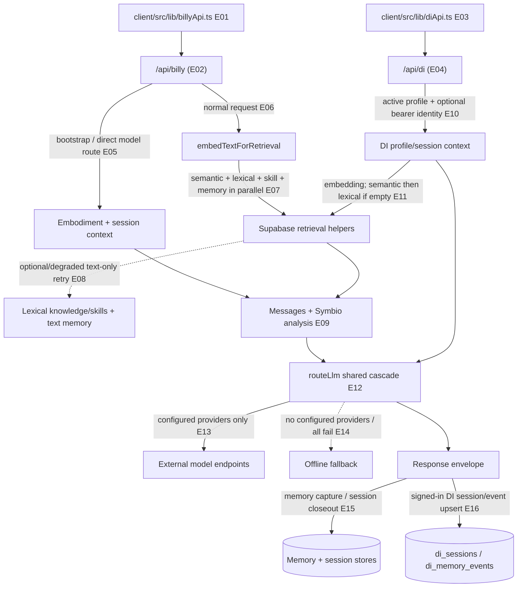

# 05 — Billy and Digital Intelligence runtime

## Plain-language

Billy and DI both assemble context before asking a configured model provider for a response. They share retrieval and provider-routing infrastructure, but their identity and continuity behavior differ: Billy has a guest path and a more explicit memory/session closeout; DI stores session state only when it resolves a signed-in Supabase user.

## Product/system

The Billy endpoint accepts synthesis/chat/bootstrap-style requests, gathers the current message plus knowledge, skills, and user-memory context, then routes the prompt through a configured provider cascade. If embeddings or semantic search fail, Billy attempts a text-only retrieval path; if all retrieval fails, it continues with no retrieved context. DI checks that the requested profile is active, resolves an optional bearer user, searches knowledge and skill fragments, retrieves user memory when signed in, calls the same provider router, then upserts DI session state and may record a memory event.

## Engineering

### Evidence keys

- **E01–E04 — Direct code path, high:** client helpers [`client/src/lib/billyApi.ts`](../../client/src/lib/billyApi.ts) and [`client/src/lib/diApi.ts`](../../client/src/lib/diApi.ts) call [`api/billy.ts`](../../api/billy.ts) and [`api/di.ts`](../../api/di.ts).
- **E05 — Direct code path, high:** Billy bootstrap branch and model dispatch in [`api/billy.ts`](../../api/billy.ts#L552).
- **E06–E08 — Direct with degraded fallback, high:** Billy embedding/retrieval starts at [`api/billy.ts`](../../api/billy.ts#L683); semantic and lexical knowledge/skill searches run in parallel when an embedding exists, and retrieval exceptions trigger a text-only retry at [`api/billy.ts`](../../api/billy.ts#L766).
- **E09 — Direct code path, high:** prompt composition, non-fatal SymbioCoder enrichment, and provider call in [`api/billy.ts`](../../api/billy.ts#L819).
- **E10–E11 — Direct code path, high:** DI active-profile check and optional bearer identity in [`api/di.ts`](../../api/di.ts#L154); embedding/search fallback and optional memory retrieval in [`api/di.ts`](../../api/di.ts#L216).
- **E12–E14 — Direct plus configuration-dependent/optional, high for implementation:** provider order is in [`api/_lib/llmRouter.ts`](../../api/_lib/llmRouter.ts#L60); unconfigured providers are skipped and no-provider/all-fail paths return offline fallback at [`api/_lib/llmRouter.ts`](../../api/_lib/llmRouter.ts#L598).
- **E15 — Direct/best-effort, high:** Billy captures memories and asynchronously records session closeout in [`api/billy.ts`](../../api/billy.ts#L914).
- **E16 — Configuration-dependent, high:** signed-in DI users update `di_sessions`; non-bootstrap exchanges can produce `di_memory_events` in [`api/di.ts`](../../api/di.ts#L314).

## Boundaries and failure behavior

The provider list in code is not evidence that a provider is configured or reachable. Billy's retrieval exception path degrades to text-only search and can continue with no context; DI's catch path clears retrieved context rather than retrying lexical search inside that exception branch. DI's lexical fallback is used when semantic results are empty and an embedding exists. The atlas does not reproduce private system-prompt content or claim that memory writes are clinically, legally, or operationally authoritative.
