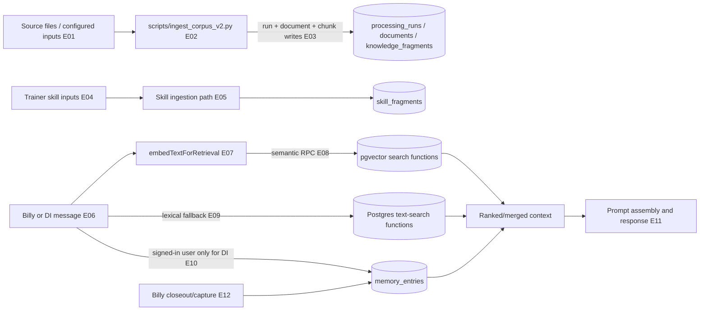

# 06 — Knowledge ingestion, retrieval, and memory

## Plain-language

Documents and skills can be turned into searchable fragments; live requests then look for relevant fragments and, when identity is available, prior user memories. Semantic search is an enhancement, not the only path—but the fallback behavior differs between Billy and DI.

## Product/system

The checked-in corpus loader chunks source files, records a processing run/document, computes embeddings, and writes fragments into Supabase. Runtime retrieval helpers expose semantic and lexical searches for knowledge, skills, and memory. Billy attempts both semantic and text retrieval in parallel when an embedding is available and retries text-only retrieval after retrieval errors. DI uses semantic results first and falls back to lexical search for empty semantic results; its exception handler returns no retrieval context. Persistent user memory is a separate per-user store and has its own retrieval/upsert path.

## Engineering

### Evidence keys

- **E01–E03 — Direct code path, high for loader implementation:** [`scripts/ingest_corpus_v2.py`](../../scripts/ingest_corpus_v2.py#L72) chunks input, writes `processing_runs`, documents, and `knowledge_fragments` (see lines 97–166). Successful execution against a live corpus was not tested.
- **E04–E05 — Configuration-dependent, medium:** skill-fragment data is handled by the shared retrieval helpers and trainer ingestion path; see [`api/_lib/supabase.ts`](../../api/_lib/supabase.ts#L790) and the ingestion workflow declaration [`.github/workflows/ingest_agent_files.yml`](../../.github/workflows/ingest_agent_files.yml).
- **E06–E09 — Direct code path, high:** Billy semantic/text paths in [`api/billy.ts`](../../api/billy.ts#L683) and shared Supabase RPC/search wrappers in [`api/_lib/supabase.ts`](../../api/_lib/supabase.ts#L720). The base knowledge/vector schema begins in [`supabase/migrations/20260311162044_new-migration.sql`](../../supabase/migrations/20260311162044_new-migration.sql#L161).
- **E10 — Direct/configuration-dependent, high:** DI resolves an optional bearer user and only retrieves memory for an identified user in [`api/di.ts`](../../api/di.ts#L176) and [`api/di.ts`](../../api/di.ts#L261).
- **E11–E12 — Direct code path, high:** prompt assembly and Billy memory closeout in [`api/billy.ts`](../../api/billy.ts#L819) and [`api/billy.ts`](../../api/billy.ts#L914); memory retrieval/capture helpers in [`api/_lib/memory.ts`](../../api/_lib/memory.ts#L433).

## Boundaries and caveats

Two GitHub Actions workflows describe manual ingestion, but their declarations are not proof the runs currently succeed; the corpus-v2 workflow arguments should be reconciled with the inspected Python CLI before operational use. The actual external corpus contents and live Supabase rows were not inspected. Fragment counts, retrieval quality, RLS effectiveness, and embedding-provider availability are therefore unresolved. The `768`-dimension alignment is present in a migration; this atlas does not assume every historical row or deployed database has already converged.
