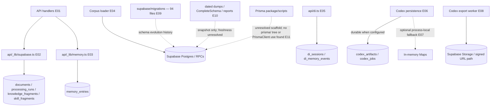

# 07 — Persistence topology and schema ownership

## Plain-language

Supabase is the repository's demonstrated persistence backbone: different paths store knowledge fragments, user memory, DI continuity, trainer state, and Codex export jobs. The migration folder records schema changes; dated dumps and generated schema views are snapshots, not proof of today's live database.

## Product/system

Runtime code uses Supabase clients/RPCs and the REST interface for relational data, Auth lookups, and Storage-backed exports. Key data families are knowledge/documents/processing runs, skill fragments, per-user memory, DI sessions/events, trainer state, and Codex artifacts/jobs. Some code can fall back to in-process maps when Supabase is absent or when an artifact is explicitly memory-backed; that path is process-local and not durable. The source tree also contains database dumps, a visual schema, and a schema report; none was queried against the live project.

## Engineering

### Evidence keys

- **E01–E02 — Direct code path, high:** [`api/_lib/supabase.ts`](../../api/_lib/supabase.ts) contains shared RPC and table helpers; Billy and DI import them.
- **E03 — Direct code path, high:** [`api/_lib/memory.ts`](../../api/_lib/memory.ts#L433) reads/captures memory; [`api/_lib/supabase.ts`](../../api/_lib/supabase.ts#L868) and later helpers call memory RPC/REST paths.
- **E04 — Direct code path, high:** [`scripts/ingest_corpus_v2.py`](../../scripts/ingest_corpus_v2.py#L97) writes processing runs and documents, then upserts knowledge fragments (lines 121–166).
- **E05 — Direct code path, high:** [`api/di.ts`](../../api/di.ts#L314) upserts session state and inserts memory events.
- **E06–E07 — Direct plus optional, high:** [`api/codex/_persistence.ts`](../../api/codex/_persistence.ts#L146) persists or holds artifacts/jobs in process-local maps; durable export job writes are at lines 166–190 and updates at 294–317.
- **E08 — Configuration-dependent, high:** [`workers/codex/runner.ts`](../../workers/codex/runner.ts) and export routes issue/poll Storage-backed results; configured bucket availability is not verified.
- **E09 — Direct repository evidence, high:** the 94 SQL migration filenames and detected DDL anchors are enumerated in [`inventory.json`](inventory.json). Representative contracts include the initial knowledge/search migration, persistent memory migration, DI runtime migration, and vector/index migration.
- **E10 — Repository artifacts, medium:** [`supabase/visual/CompleteSchema.sql`](../../supabase/visual/CompleteSchema.sql), [`supabase/schema_contract_report.sql`](../../supabase/schema_contract_report.sql), and dated dumps under [`supabase/db_dumps/`](../../supabase/db_dumps/) are retained as reference artifacts, not asserted as current live schema.
- **E11 — Unresolved, medium:** [`package.json`](../../package.json) declares Prisma-related scripts/dependencies, but no `prisma/` directory or `PrismaClient` construction was found in the inspected tree. This is not evidence of an active Prisma persistence runtime.

## Boundaries and caveats

Migration history is the most reproducible checked-in schema evolution record, but it does not prove migration application order or live database state. RLS policies, dynamic SQL, generated types, snapshots, and deployed schema may diverge. In-process Codex fallbacks disappear on process restart and must not be treated as durable. No live Supabase inspection or migration execution was performed.
