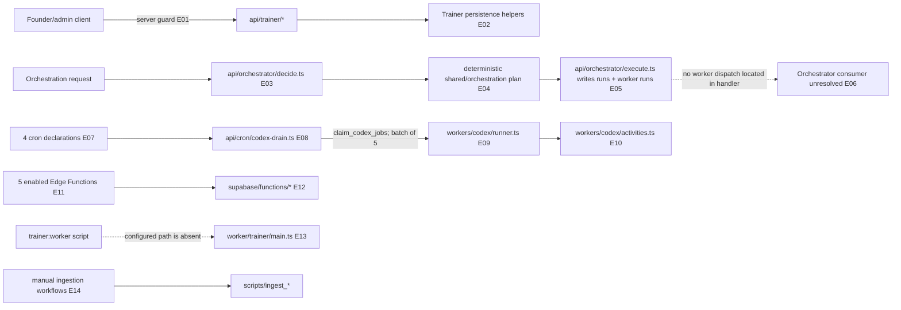

# 08 — Trainer, orchestration, and background work

## Plain-language

There are three different things here, not one universal worker system: protected trainer/control APIs, orchestration handlers that record a proposed run, and a scheduled Codex export runner that actually drains queued jobs. Several other job entrypoints are configuration declarations or have a missing target.

## Product/system

Trainer endpoints use founder/admin checks. The orchestrator computes a deterministic decision and worker plan, then writes run/worker-run records; the inspected handler stops after persistence and response rather than invoking those planned workers. Separately, Vercel schedules four cron routes, including a Codex export drain every two minutes. That route claims pending Codex jobs and calls the worker runner. Supabase config also enables five Edge Functions with a custom shared-secret verifier. The package's declared trainer worker points to a file absent from this checkout.

## Engineering

### Evidence keys

- **E01–E02 — Direct code path, high:** [`api/trainer/_helpers.ts`](../../api/trainer/_helpers.ts#L1) applies founder/admin guards; trainer handlers such as [`api/trainer/agents.ts`](../../api/trainer/agents.ts) use the helper and server persistence layer.
- **E03–E05 — Direct code path, high:** [`api/orchestrator/decide.ts`](../../api/orchestrator/decide.ts#L113) computes a decision/plan; [`api/orchestrator/execute.ts`](../../api/orchestrator/execute.ts#L73) persists run records and returns the plan at lines 118–149. This handler contains no downstream worker invocation.
- **E06 — Unresolved, medium:** [`api/orchestrator/execute.ts`](../../api/orchestrator/execute.ts) and [`api/orchestrator/decide.ts`](../../api/orchestrator/decide.ts) persist a plan; a bounded repository search found no tracked consumer for the worker-run rows. This is an absence-of-evidence statement for this checkout, not other infrastructure.
- **E07–E09 — Configuration-dependent then direct code path, high:** [`vercel.json`](../../vercel.json#L6) lists four scheduled routes; [`api/cron/codex-drain.ts`](../../api/cron/codex-drain.ts#L43) authorizes cron calls, claims jobs, and calls the runner.
- **E10 — Direct code path, high:** [`workers/codex/activities.ts`](../../workers/codex/activities.ts#L22) implements PDF, HTML, and JSON export activities; unsupported formats throw at line 53. [`workers/codex/runner.ts`](../../workers/codex/runner.ts#L116) transitions and executes jobs.
- **E11–E12 — Configuration-dependent, high for declaration:** [`supabase/config.toml`](../../supabase/config.toml) enables five Edge Functions; implementations are under [`supabase/functions/`](../../supabase/functions/), with shared verification in [`supabase/functions/_shared/auth.ts`](../../supabase/functions/_shared/auth.ts).
- **E13 — Unresolved/config mismatch, high:** [`package.json`](../../package.json#L20) declares `trainer:worker` targeting `worker/trainer/main.ts`; no `worker/` tree exists in this snapshot.
- **E14 — Configuration-dependent, medium:** [`.github/workflows/ingest_corpus_v2.yml`](../../.github/workflows/ingest_corpus_v2.yml) and [`.github/workflows/ingest_agent_files.yml`](../../.github/workflows/ingest_agent_files.yml) invoke ingestion scripts; a checked-in workflow declaration is not a successful job run.

## Boundaries and operational caveats

The four Vercel schedules and five enabled Edge Functions are local configuration only. The Codex worker is the clearest connected queue-to-work path in this repository, but its platform runtime, service configuration, credentials, and storage bucket were not tested. Orchestration plan persistence should not be described as autonomous worker execution. The trainer command/file mismatch and workflow/parser mismatch should be reconciled before relying on those paths operationally.
