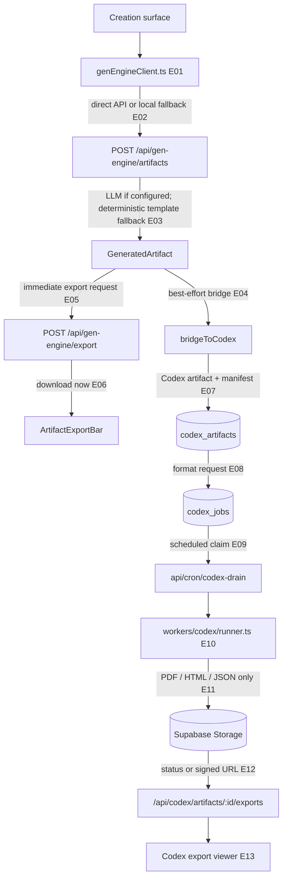

# 09 — Creation, rendering, and exports

## Plain-language

Creation and export are two related but non-identical lanes. Gen Engine can synthesize a generated artifact and attempt a Codex bridge; it also has immediate client-triggered downloads. Codex has its own durable artifact/job model and scheduled export worker. Do not assume every export button is backed by the durable queue.

## Product/system

The Gen Engine artifact route produces a typed artifact, may call the shared model router, applies target-specific validation/fallbacks, then calls `bridgeToCodex`. A bridge failure is returned as a warning rather than cancelling the generated artifact response. The client also has local fallback behavior when a remote generation request fails. The `ArtifactExportBar` posts the artifact to the Gen Engine export route and downloads the result immediately. In contrast, the Codex flow persists an artifact/export manifest, enqueues a format job, and relies on the scheduled Codex drain to render and store supported outputs.

## Engineering

### Evidence keys

- **E01–E02 — Direct plus optional/degraded, high:** [`client/src/lib/genEngineClient.ts`](../../client/src/lib/genEngineClient.ts) selects the remote route and contains local fallback behavior.
- **E03–E04 — Direct code path with configuration-dependent model call and optional bridge, high:** [`api/gen-engine/artifacts.ts`](../../api/gen-engine/artifacts.ts#L194) validates/falls back target content, creates the final artifact, then calls `bridgeToCodex` at lines 229–270; bridge errors become warnings.
- **E05–E06 — Direct immediate-download path, high:** [`client/src/components/ArtifactExportBar.tsx`](../../client/src/components/ArtifactExportBar.tsx#L17) posts to `/api/gen-engine/export` and creates a browser download; this does not use the Codex job queue.
- **E07–E08 — Direct plus optional process-local fallback, high:** [`api/codex/_persistence.ts`](../../api/codex/_persistence.ts#L146) updates artifact records and enqueues jobs in Supabase or in-memory maps depending on configuration/artifact origin.
- **E09–E10 — Configuration-dependent then direct code path, high:** [`api/cron/codex-drain.ts`](../../api/cron/codex-drain.ts#L79) claims pending jobs and invokes [`workers/codex/runner.ts`](../../workers/codex/runner.ts#L116).
- **E11 — Direct code path, high:** [`workers/codex/activities.ts`](../../workers/codex/activities.ts#L22) supports PDF, HTML, and JSON; other formats throw as unsupported by the current durable adapter.
- **E12 — Direct code path, high:** [Codex artifact exports route](../../api/codex/artifacts/%5BartifactId%5D/exports.ts) exposes job/export state and download access.
- **E13 — Direct client path, medium:** [`client/src/lib/rendering/ArtifactExportViewer.tsx`](../../client/src/lib/rendering/ArtifactExportViewer.tsx) provides a client export viewer; no claim is made that every Codex handler has a user-facing screen wired to it.

## Boundaries and caveats

The generated artifact can still return if the Codex bridge fails. Immediate Gen Engine exports and durable Codex exports differ in persistence, scheduling, and supported formats. The in-memory Codex fallback is not restart-safe. The existence of the route and worker source does not prove that the cron, storage bucket, or signed-URL configuration is live. Audio/spatial export is not supported by the inspected durable worker adapter.
