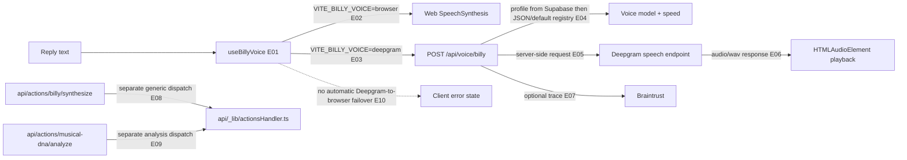

# 10 — Voice and media paths

## Plain-language

Billy's spoken reply has two explicit modes: speech generated by the browser, or server-generated WAV from Deepgram. They are separate branches selected by client configuration; a Deepgram failure is surfaced as an error rather than silently switching to the browser voice. Other action endpoints exist, but this map does not collapse them into one imagined media pipeline.

## Product/system

`useBillyVoice` defaults to the configured Deepgram mode, can use the browser's native speech synthesis, or can disable speech. In Deepgram mode the browser sends cleaned text to `/api/voice/billy`; the server resolves a voice profile from Supabase or a checked-in JSON registry, sends text to Deepgram, and returns WAV. A separate `api/actions/billy/synthesize` wrapper dispatches through the generic action handler; it is not the endpoint called by this hook. The Musical DNA analysis action is another distinct dispatcher route, not a speech output step.

## Engineering

### Evidence keys

- **E01–E03 — Direct/configuration-dependent, high:** [`client/src/hooks/useBillyVoice.ts`](../../client/src/hooks/useBillyVoice.ts#L27) defines `deepgram`, `browser`, and `disabled` modes; the request and mode branches are at lines 150–250.
- **E04–E06 — Direct code path, high:** [`api/voice/billy.ts`](../../api/voice/billy.ts#L26) reads configuration without exposing values, resolves the profile at lines 42–74, calls Deepgram at lines 132–145, and returns WAV at lines 149–158.
- **E07 — Optional/configuration-dependent, medium:** the voice route wraps its provider call with `traceBraintrust` in [`api/voice/billy.ts`](../../api/voice/billy.ts#L110).
- **E08–E09 — Direct code path, high:** [`api/actions/billy/synthesize.ts`](../../api/actions/billy/synthesize.ts) and [`api/actions/musical-dna/analyze.ts`](../../api/actions/musical-dna/analyze.ts) delegate to the shared action handler.
- **E10 — Direct code path, high:** the Deepgram branch in [`client/src/hooks/useBillyVoice.ts`](../../client/src/hooks/useBillyVoice.ts#L224) catches and exposes errors; browser speech is a separately selected branch, not an automatic provider fallback.

## Boundaries and caveats

The route requires Deepgram configuration and can return a service-unavailable response if it is absent; actual voice quality, quota, provider availability, and persisted profile contents were not tested. The browser voice depends on browser/device availability and installed voices. The action dispatcher may have other modality behavior; only its wrapper relationship is mapped here. No claim is made about a unified image/audio/video pipeline.
