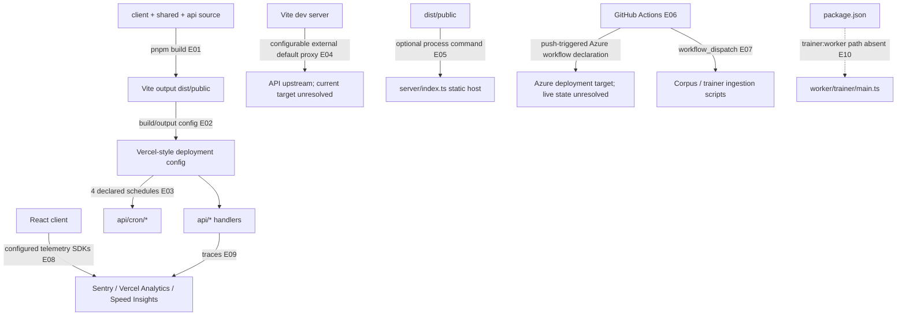

# 11 — Build, deployment, health, and operations

## Plain-language

The repository can build a static client, expose Vercel-style API handlers, and declare scheduled routes. It also contains a small static Express server and an Azure-oriented GitHub workflow. Those are multiple operational declarations; this checkout alone does not tell us which one currently serves production.

## Product/system

The package build runs TypeScript compilation followed by Vite, producing `dist/public`. `vercel.json` points to that output and declares four cron schedules. Local Vite development has a configurable `/api` proxy whose default target is external, so a local UI session may not exercise the checked-out API code. `server/index.ts` is an optional Express static host with a Sentry debug route, not an API server. A GitHub workflow also declares deployment to Azure and other workflows provide manual ingestion entrypoints. Sentry, Braintrust, Vercel Analytics, and Speed Insights are present in code/configuration, but telemetry delivery was not tested.

## Engineering

### Evidence keys

- **E01–E02 — Direct/configuration-dependent, high:** [`package.json`](../../package.json#L7) declares `tsc && vite build`; [`vite.config.ts`](../../vite.config.ts#L170) outputs `dist/public`; [`vercel.json`](../../vercel.json#L3) declares the build command/output directory and rewrites.
- **E03 — Configuration-dependent, high for declaration:** [`vercel.json`](../../vercel.json#L6) defines four schedules: provenance upgrade every two hours, Codex drain every two minutes, profile-portrait drain every five minutes, and monthly profile-portrait cadence.
- **E04 — Configuration-dependent, medium:** [`vite.config.ts`](../../vite.config.ts#L181) configures development proxying; default upstream is external and can be overridden.
- **E05 — Direct code path, high:** [`package.json`](../../package.json#L11) runs [`server/index.ts`](../../server/index.ts#L12), which serves static files and a Sentry debug route.
- **E06 — Configuration-dependent, high for workflow declaration:** [`.github/workflows/main_gestaltview.yml`](../../.github/workflows/main_gestaltview.yml) is push-triggered and declares the Azure deployment path. Whether it is the active deployment is unresolved.
- **E07 — Configuration-dependent, medium:** manual workflow declarations are in [`.github/workflows/ingest_corpus_v2.yml`](../../.github/workflows/ingest_corpus_v2.yml) and [`.github/workflows/ingest_agent_files.yml`](../../.github/workflows/ingest_agent_files.yml); they were not executed.
- **E08–E09 — Optional/configuration-dependent, medium:** browser telemetry integrations are declared in [`client/src/App.tsx`](../../client/src/App.tsx) and server instrumentation in [`instrument.js`](../../instrument.js) / [`api/_lib/sentry.ts`](../../api/_lib/sentry.ts); delivery was not tested.
- **E10 — Unresolved/config mismatch, high:** [`package.json`](../../package.json#L20) names `worker/trainer/main.ts`, which is absent from the inspected tree.

## Boundaries and operational cautions

Build and deployment configuration are not proof of successful build, active hosting, or correct secrets. Vite's external development proxy can conceal local handler changes. The Azure workflow and Vercel project configuration should be reconciled with the actual deployment owner before this map is used as an on-call runbook. The Sentry debug endpoint may be disabled in production by configuration. No build, CI workflow, cron, telemetry event, or deployment was run for this atlas.
